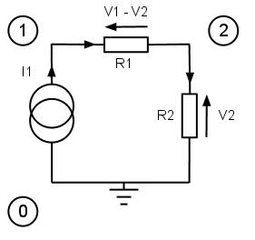

# DC Analysis

*what is DC analysis?*

The methods of DC analysis are at the heart of both transient and AC analysis, and are an important starting point for learning about circuit simulation.

The fundamental equations used to describe a circuit in computer simulations are usually obtained by nodal analysis. Mesh analysis is an alternative, but automating the process is difficult [[ref](https://books.google.co.uk/books/about/Computer_Methods_for_Circuit_Analysis_an.html?id=7-6t1RJSGC0C&hl=en)], so its use is limited and nodal analysis is preferred.

## Linear DC Analysis

Using nodal analysis, solutions for the DC voltage at every node for linear, time-invariant (LTI) systems can be easily calculated. Inductors are modelled as short circuits, capacitors as open circuits and AC sources set to zero to give a DC solution.

### Conventional Nodal Analysis

An equation is calculated for each node using Kirchhoff’s Current Law (KCL). For a circuit with n+1 nodes, there arise n+1 simultaneous equations, which can be expressed in matrix form. One node must always be used as a reference, reducing the number of unknown variables by one. Doing this also means that there is an excess equation, which can be omitted, resulting in n equations for n+1 nodes. The resulting circuit equation takes the following form:

$$
Yv=J
$$

Where:

- Y - n×n nodal admittance matrix
- v - n×1 node voltage vector
- J - n×1 current source vector

Rather than constructing a list of equations node-by-node, it is often easier to build up the matrix element-by-element, using ‘matrix stamps’. Using this technique, every element contributes a set pattern to Equation . Equation  shows the contribution to the $$Y$$ matrix of a resistor with conductance $$g_k$$ from node $$i$$ to node $$j$$:

$$
\begin{array}{cc}
\begin{bmatrix}
g_k & -g_k \\
-g_k & g_k
\end{bmatrix}
&
\begin{matrix}
row\ i\\ 
row\ j
\end{matrix}
\\
col\ i \quad col j
\end{array}
$$

Each of these stamps is added together in place to form the complete equation. 
The diagram below shows a three-node example circuit consisting of a current source and two resistors. The circled numbers label the three nodes, and V0 is earthed at zero volts.

## Nonlinear DC Analysis
