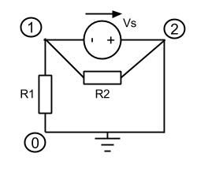

# Modified Nodal Analysis

For independent voltage sources, simple nodal analysis isn’t enough. To solve circuits with these elements, Modified Nodal Analysis (MNA) is required. All controlled sources (except Voltage-Controlled Current Sources) consist of at least one independent voltage source, and MNA is needed to model these components too.

## Example

A circuit which requires MNA is shown above. Since the voltage between nodes $$1$$ and $$2$$ is known, the voltages at those nodes are not independent of each other. An extra independent variable and equation is needed. The current through the voltage source is added as an independent variable, and the following equation added.

$$
v_2-v_1=V_s
$$

The resulting circuit equation is shown below.

$$
\begin{bmatrix}
\frac{1}{R_1} + \tfrac{1}{R_2} & \tfrac{-1}{R_2} & 1 \\
\tfrac{-1}{R_2} & \tfrac{1}{R_2} & -1\\
1 & -1 & 0
\end{bmatrix}
\begin{bmatrix}
v_{1}\\
v_{2}\\
i_{12}
\end{bmatrix}
=
\begin{bmatrix}
I_{1}=0\\
I_{2}=0\\
V_{12}
\end{bmatrix}
$$

## Voltage Source Stamp

The *stamp* for a voltage source between nodes $$i$$ and $$j$$ for an $$n\!+\!1$$ node circuit is:

$$
\begin{align*}

&
\begin{bmatrix}
 &  & 1 \\
 &  & -1 \\
1\quad & -1\quad & 0
\end{bmatrix}
\begin{bmatrix}
 \\
 \\
i_{12}
\end{bmatrix}
=
\begin{bmatrix}
 \\
 \\
V_{12}
\end{bmatrix}
\begin{matrix}
row\ i\\
row\ j\\
row\ n\!+\!1
\end{matrix}
\\
&
\begin{matrix}
col\ i & col\ j & col\ n\!+\!1
\end{matrix}

\end{align*}
$$

## Equation Conditioning

A consequence of MNA is the appearance one or more zeros on the diagonal of the $$Y$$ matrix, as seen above. This can cause problems when using simultaneous equation solvers.

It is possible to swap rows to move the zeros away from the diagonal, but a better method exists. This involves eliminating the unknown current values and rearranging the equations to closer resemble conventional nodal analysis. Doing this results in equations that are often:

- Better conditioned numerically
- More compact
- More efficient to solve than the original MNA equations.

For larger matrices, this is likely to have significant benefits.

### Example

A simple example of this procedure is shown in the following equations for a generic three-node circuit, with a voltage source $$V_{12}$$ between nodes 1 and 2.

The matrix equation is:

$$
\begin{bmatrix}
y_{11} & y_{12} & 1 \\
y_{21} & y_{22} & -1 \\
1 &-1 & 0
\end{bmatrix}
\begin{bmatrix}
v_{1} \\
v_{2} \\
i_{12}
\end{bmatrix}
=
\begin{bmatrix}
I_{1} \\
I_{2} \\
V_{12}
\end{bmatrix}
$$

Which represents the set of simultaneous equations:

$$
\begin{align}
y_{11}v_1 + y_{12}v_2 + i_{12} &= I_1 \\ 
y_{21}v_1 + y_{22}v_2 - i_{12} &= I_2 \\ 
v_1 - v_2 &= V_{12}
\end{align}
$$

Add row 2 to row 1 to eliminate $$i_{12}$$. $$i_{12}$$ can be calculated later by substituting $$v_1$$ and $$v_2$$ into equation 1 or 2 above.

$$
\begin{pmatrix}
y_{11}+y_{21} & y_{12}+y_{22} \\
1 &-1
\end{pmatrix}
\begin{pmatrix}
v_{1} \\
v_{2}
\end{pmatrix}
=
\begin{pmatrix}
I_{1}+I_{2} \\
V_{12}
\end{pmatrix}
$$

$$
\begin{align*}
(y_{11}+y_{21})v_1 + (y_{12}+y_{22})v_2 + i_{12} &= I_1+I_2 \\
v_1 - v_2 &= V_{12}
\end{align*}
$$

