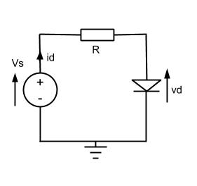
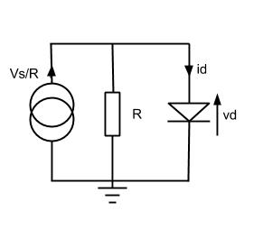
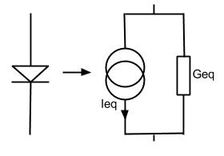

# Nonlinear DC Analysis

Circuits with nonlinear components pose a more difficult problem than LTI circuits. The resulting nonlinear equations need to be solved iteratively using techniques such as Newton-Raphson. The general procedure is as follows:

1. Open capacitors, short inductors, ground AC sources
1. Newton-Raphson
  1. Guess voltages and/or currents
  1. Linearise by replacing nonlinear elements with linear equivalent models for the estimated bias point
  1. Linear DC analysis
  1. If converged, solution (bias point) found. Else, back to 2.1 with improved guess.

A simple example with a diode is considered below. The Thévenin and Norton equivalents (respectively) for a simple diode circuit are shown below.

From this we can derive the equation:

$$
\frac{v_d}{R}+i_d=\frac{V_s}{R}
$$

Replacing $$i_d$$ with the diode equation gives:

$$
\frac{v_d}{R}+ I_{SAT}\left [ exp\left ( \frac{qV_d}{\eta kT} \right )-1 \right ] =\frac{V_s}{R}
$$

This nonlinear equation needs to be solved iteratively using Newton-Raphson. A simple linear representation of a diode is shown below. This substitution is performed in the linearisation step.

There are two interlinking problems with Newton-Raphson (or any similar technique): efficiency and convergence. A poor initial guess can cause very slow convergence, or for some circuits it may never converge at all. A good initial guess is therefore necessary for efficiency.

There are other factors also affecting convergence, including poor element modelling or component values. An example given in [The SPICE Book](http://www.amazon.co.uk/The-Spice-Book-Andre-Vladimirescu/dp/0471609269) shows how a voltage source connected to an ideal diode gives numbers higher than can be represented using floating-point numbers on some computers, which clearly leads to errors in the solution.
