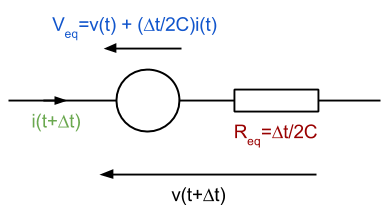

# Transient Analysis

Transient analysis is used to show the state of a circuit as it varies with time, rather than just the steady state solution, as in DC analysis.

TODO discuss pros/cons of Norton vs Thevenin, FE vs BE vs Trap.

## Linear Transient Analysis

LTI RLC circuits give linear differential equations, with capacitors having the form:

$$
i(t)=C\frac{\partial v(t)}{\partial t}
$$ 

Using this capacitor as an example, Equation  can be integrated to give the voltage at time $$t+\Delta t$$, where $$\Delta t$$ is the time step:

$$
v(t+\Delta t)=v(t)+\frac{1}{C}\int_{t}^{\Delta t}i(\tau )d\tau
$$

A number of integration schemes can be used, including Forward/Backward Euler, and Trapezoidal. Using the Trapezoidal scheme results in an implicit formula, containing both voltage and current at the next time step:

$$
v(t+\Delta t)=\color{#15c}{v(t)+\frac{\Delta t}{2C}i(t)}+\color{#900}{\frac{\Delta t}{2C}}\color{#7a5}{i(t+\Delta t)}
$$

However, this problem can be overcome by replacing the capacitor with a *companion model*, as shown in below. The colouring is kept the same as the equation above, to show the connection between the two.

This requires MNA, because of the voltage source. A Norton equivalent can be used, but the $$\frac{2C}{\Delta t}$$ term may become excessively large for small time steps $$\Delta t\rightarrow 0$$, due to the limited range and precision of floating-point numbers in a computer. Equally, the Thévenin circuit has similar problems for DC analysis, $$\Delta t\rightarrow \infty$$.  Which model is used should depend on the situation.

From this, it can be seen that the general steps for linear transient analysis are:

1. Start with known initial conditions
2. Increment time by $$\Delta t$$ and use the appropriate companion models with calculated values
3. Perform a DC analysis
4. Back to step 1 with results

Due to the Newton-Raphson approximation at each stage of transient analysis, there is always going to be some error. Local error is the error in a single iteration, and cumulative error is the error that accumulates as a result of many iterations. With any luck, the local errors will be small and random, with equal values of positive and negative error, so will cancel out on average over many iterations. This may not always be the case though, and it is possible for the analysis to become unstable, with the cumulative error increasing in every iteration.

For transient analysis, it is important to know that the speed of convergence of each iteration relies on a good choice of $$\Delta t$$. This time step can also be fixed or dynamic, with a dynamic time step being more difficult to implement well, but can mean greater speed of convergence in many situations.

The [simulator created by Paul Falstad](http://www.falstad.com/circuit/) uses a fixed, but adjustable, time step, which defaults to $$5\mu s$$.

## Nonlinear Transient Analysis

Nonlinear transient analysis is very similar to the linear version, but with additional nonlinear DC analysis stages. The general process is:

1. Nonlinear DC biasing
2. Initial conditions
3. Companion models
4. Nonlinear DC analysis
5. Increment time
6. Back to step 3 with new results